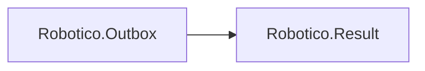

# Robotico.Outbox

[](https://dotnet.microsoft.com/download/dotnet/8.0)
[](https://dotnet.microsoft.com/download/dotnet/10.0)
[](https://github.com/robotico-dev/robotico-outbox-csharp/packages)
[](https://github.com/robotico-dev/robotico-outbox-csharp/actions/workflows/publish.yml)

Reference **Robotico.Outbox** when you use the **transactional outbox pattern**. Interface: `IOutbox` (EnqueueAsync, CommitAsync returning `Result`).

## Robotico dependencies



## Installation

```bash
dotnet add package Robotico.Outbox
```

## License

See repository license file.
