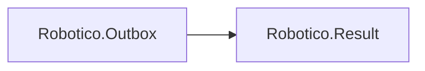

# Robotico.Outbox

[](https://dotnet.microsoft.com/download/dotnet/8.0)
[](https://dotnet.microsoft.com/download/dotnet/10.0)
[](https://github.com/robotico-dev/robotico-outbox-csharp/packages)
[](https://github.com/robotico-dev/robotico-outbox-csharp/actions/workflows/publish.yml)

Reference **Robotico.Outbox** when you use the **transactional outbox pattern**. Interface: `IOutbox` (EnqueueAsync, CommitAsync returning `Result`).

## Robotico dependencies



## Related packages (reuse where it fits)

| Package | Use with Outbox |
|---------|------------------|
| **Robotico.Option** | Optional message metadata (e.g. correlation id, partition key) as `Option<T>`; avoids null. |
| **Robotico.Resilience** | Retry or circuit breaker in the **outbox processor** when publishing messages after commit (recommended). |
| **Robotico.Validation** | Validate messages before `EnqueueAsync` (e.g. `IValidator<TMessage>`). |

## Quick start

Enqueue messages in the same transaction as your domain changes, then commit:

```csharp
Result enqueueResult = await _outbox.EnqueueAsync(new OrderPlaced(orderId), cancellationToken);
if (enqueueResult.IsError(out _)) { /* handle */ }
Result commitResult = await _outbox.CommitAsync(cancellationToken);
```

A separate outbox processor (your code or a host) reads committed rows and publishes to the message bus. Use Robotico.Resilience for retry when publishing. See `docs/design.adoc` for design and related packages.

## Installation

```bash
dotnet add package Robotico.Outbox
```

## Building and testing

```bash
dotnet restore
dotnet build -c Release
dotnet test -c Release --verbosity normal
```

With coverage (Coverlet):

```bash
dotnet test -c Release --collect:"XPlat Code Coverage" --results-directory ./coverage
```

CI enforces 90% line coverage (or passes when the library has no executable lines) and runs a trim-validate build. Versioning: SemVer.

## License

See repository license file.
